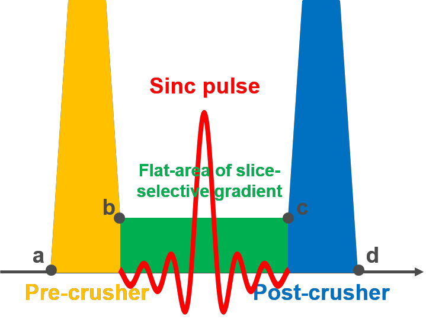

# Pulseq tutorial "From FID to PRESS"

Welcome to the "From FID to PRESS" tutorial repository! This was initially developed for the Pulseq software demonstration and hands-on session at the **Italian Chapter of ISMRM 2022** in Pisa.

The tutorial starts with the very basic first steps from an FID and non-slective spin-echo sequence and moves on towards spectroscopic PRESS sequence. The raw data were acquired in a fat-water phantom, which explains the appearence of the off-center press spectrum, which was deliberatly placed to capture both fat and water.

The slide deck entitled [doc/01_from_FID_to_PRESS.pdf](doc/01_from_FID_to_PRESS.pdf) explains the basic properties of the objects from which the pulse sequence is built 
such ar RF and gradient pulses and shows the sequence diagrams of all
steps and visualises the changes at each step. We recommend using Meld
software to highlight the source code changes between steps 01 and 05.

***s01\_FID***

***s01*** describes the simplest FID sequence with a single flip angle
(FA). It is constructed with two blocks -- one with an RF event and the
other with an ADC event.

***s02\_FID\_multipleFAs***

***s02*** describes an FID sequence with 9 FAs, established based on the
FID sequence described in ***s01***. The TR containing two blocks is
repeated 9 times. The flip angle of the RF event is changed during each
TR repetition.

***s03\_SE***

***s03*** describes a spin-echo (SE) acquisition with four blocks. It
contains an RF pulse for non-selective excitation, an RF pulse for
refocusing and an ADC.

***s04\_SE\_withBackGrad***

A background gradient is added to ***s03*** during the entire sequence
to construct ***s04***.

***s05\_SE\_withSpoilers***

***s05*** is constructed based on ***s03***: two spoiler gradients are
inserted during the delay of the refocusing RF pulse and the delay of
the ADC in ***s03***, acting as a pair of crushers.

***s06\_PRESS***

***s06*** establishes a Point RESolved Spectroscopy (PRESS) sequence.
The core sequence consists of three slice-selective RF pulses
(90°-180°-180°) applied concurrently with three orthogonal gradients (x,
y and z) (for more details, please go to
[https://mriquestions.com/press.html\#](https://mriquestions.com/press.html)).

The mr.makeSincPulse function makes a sinc pulse and gradients for slice
selection.

The mr.makeExtendedTrapezoidArea function makes a shortest possible
extended trapezoid with a given area, which starts and ends as non-zero
gradient values.

The mr.makeExtendedTrapezoid function creates an "arbitrary" gradient by
combing a set of amplitude points and the corresponding set of time
points, as shown in Figure 1.

**Figure** **1** slice-selective **sinc pulse** and **gradient** with a
pair of crusher gradients for selecting desired coherence pathways.
**a** (**c**) and **b** (**d**) are the first and last points of the
**pre-** (**post-**) crusher gradient, which are both realized as
Extended Trapezoids.

The sequence diagram of ***s06*** includes 7 blocks per TR. Note that the TE is
defined as 2 \* delay between the centres of the two refocusing RF
pulses.

## Quick links

Pulseq Matlab repository: 
https://github.com/pulseq/pulseq

## Quick instructions

The source code of the demo sequences and reconstruction scripts is the core of this repository. Please download the files to your computer and make them available to Matlab (e.g. by saving them in a subdirectory inside your Pulseq-Matlab installation and adding them to the Matlab's path). There are two sub-directories:

* seq : contains example pulse sequences specifically prepared for this demo
* recon : contains the reconstruction scripts tested with the above sequences
* data : contains raw MR data in the Siemens TWIX format and the corresponding pulse sequences in the Pulseq format

## How to follow 

We strongly recommend using a text compate tool like *meld* (see this [Wikipedia page](https://en.wikipedia.org/wiki/Meld_(software)) and compare sequences from subsequent steps to visualithe the respective steps.

## Further links

Check out the main *Pulseq* repository at https://github.com/pulseq/pulseq and familarizing yourself with the code, example sequences and reconstructon scripts (see 
[pulseq/matlab/demoSeq](https://github.com/pulseq/pulseq/tree/master/matlab/demoSeq) and [pulseq/matlab/demoRecon](https://github.com/pulseq/pulseq/tree/master/matlab/demoRecon)). If you already use Pulseq, consider updating to the current version.

