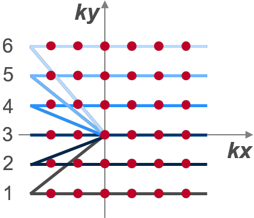
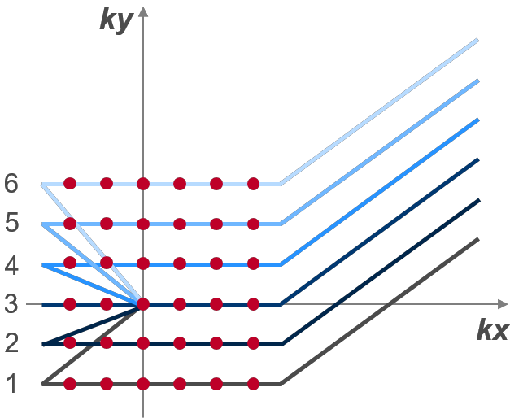

# Pulseq tutorial "Basic GRE"

Welcome to the "Basic GRE" tutorial! It was initially developed for the Pulseq software demonstration and hands-on session at the **ISMRM 2019** in Montreal.

This tutorial demonstrates how to expand a basic Gradient-Echo (GRE)
sequence to an advanced GRE sequence with a desired steady-state
magnetisation evolution needed to generate T1 contrast. It contains six
steps from ***s01\_GRE\_tutorial\_step0*** to
***s06\_GRE\_tutorial\_step5***. We recommend using Meld software to
highlight the changes at each step. The slide deck entitled
[02_basic_gradient_echo.pdf](./doc/02_basic_gradient_echo.pdf) shows the 
sequence diagrams of all steps and visualises the changes at each step.

The transverse magnetisation may persist from cycle to cycle in a GRE
sequence with short repetition times (e.g. shorter than \~3\*T2).
*Spoiling* tries to approximate a situation that the steady-state
magnetisation has no transverse components immediately before each RF
pulse. Three methods may be used alone or in combination to spoil
transverse magnetisation.

1.  Long TR spoiling. When TR\>\>T2\*, the transverse magnetisation will
    naturally decay to zero by the end of the cycle. Thus, any GRE
    sequence using TR values of several hundred milliseconds or longer
    will be "naturally" spoiled.

2.  Gradient spoiling. In this method, spoiling is performed by applying
    the slice-selective (and sometimes readout) gradients at the end of
    each cycle just before the next RF pulse. Several gradient spoiling
    concepts have been tried in the MR history, with the strength of the
    spoiler gradient remaining constant or varied linearly or
    semi-randomly from TR to TR. In the present example a constant
    spoiler is used and an appropriate phantom with a sufficiently long
    T2 it demonstrates that gradient spoiling does not work unless the
    spoiler is so strong that the intrinsic diffusion weighting would
    kill the signal.

3.  It is also demonstrated that it is necessary to refocus the phase
    encoding moment at the end of the TR cycle to avoid artefacts.

4.  RF-spoiling. Here the phase of the RF carrier is changed according
    to a predefined formula from TR to TR. Using a completely randomised
    pattern of phase changes is not ideal because unintended spin
    clustering may occur, and the degree of spoiling may change from one
    interval to the next. A superior method is to increment the phase
    quadratically using a recursive formula. RF spoiling is always
    combined with a moderate constant spoiling in read and slice
    directions and phase-encoding refocusing. For further details about
    spoiling, please go to
    <https://mriquestions.com/spoiling---what-and-how.html>.

***s01\_GRE\_tutorial\_step0***

***s01*** is a *basic* 2D slice-selective GRE sequence. Each TR of this
sequence contains 5 blocks. The corresponding k-space is shown in Figure
1.

**Figure** **1** K-space of s01\_GRE\_tutorial\_step0 sequence (6\*6
encodes).

***s02\_GRE\_tutorial\_step1***

***s02*** is a 2D slice-selective GRE sequence with three spoiler
gradients added in slice-selective, readout and phase-encoding
direction. Its k-space is shown in Figure 2.

**Figure** **2** K-space of s02\_GRE\_tutorial\_step1 sequence (6\*6
encodes).

***s03\_GRE\_tutorial\_step2***

***s03*** is a 2D slice-selective GRE sequence with two spoiler
gradients in slice-selective and readout directions and one rewinder
gradient in the phase-encoding direction. It is built by altering the
gyPost gradient in ***s01*** to rephase in the phase-encoding direction
for subsequent phase-encoding steps. The k-space is shown in Figure 3.

**Figure** **3** K-space of s03\_GRE\_tutorial\_step2 sequence (6\*6
encodes).

***s04\_GRE\_tutorial\_step3***

***s04*** is built by adding RF-spoiling to ***s03***. The RF-spoiling
is achieved by quasi-randomly varying the RF phase offset in the *i*^th^
phase-encoding step,
$\text{φ}_{\text{i}}\text{\ =\ mod}\left( \text{117\ *\ }\left( \text{i}^{\text{2}}\text{\ +\ }\text{i}\text{\ }\text{+\ 2} \right)\text{,\ 360} \right)\text{*}\frac{\text{π}}{\text{180}}$.

***s05\_GRE\_tutorial\_step4***

In ***s05***, the receiver phase offset is set to follow the transmitter
phase offset, $\text{φ}_{\text{i}}$, in the *i*^th^ phase-encoding step.

***s06\_GRE\_tutorial\_step5***

***s06*** adds some *dummy* scans (i.e. plays out multiple cycles of the
sequence without recording a signal) to ***s05*** to establish (near)
steady-state magnetisation in the GRE sequence prior to beginning of the
ADC recording. For more details about dummy scans, please go to
<https://mriquestions.com/dummy-cycles.html>.

## Quick links

Pulseq Matlab repository: 
https://github.com/pulseq/pulseq

## Quick instructions

The source code of the demo sequences and reconstruction scripts is the core of this repository. Please download the files to your computer and make them available to Matlab (e.g. by saving them in a subdirectory inside your Pulseq-Matlab installation and adding them to the Matlab's path). There are two sub-directories:

* seq : contains example pulse sequences specifically prepared for this demo
* recon : contains the reconstruction scripts tested with the above sequences
* data : contains raw MR data in the Siemens TWIX format and the corresponding pulse sequences in the Pulseq format

## How to follow 

We strongly recommend using a text compate tool like *meld* (see this [Wikipedia page](https://en.wikipedia.org/wiki/Meld_(software)) and compare sequences from subsequent steps to visualithe the respective steps.

## Further links

Check out the main *Pulseq* repository at https://github.com/pulseq/pulseq and familarizing yourself with the code, example sequences and reconstructon scripts (see 
[pulseq/matlab/demoSeq](https://github.com/pulseq/pulseq/tree/master/matlab/demoSeq) and [pulseq/matlab/demoRecon](https://github.com/pulseq/pulseq/tree/master/matlab/demoRecon)). If you already use Pulseq, consider updating to the current version.
