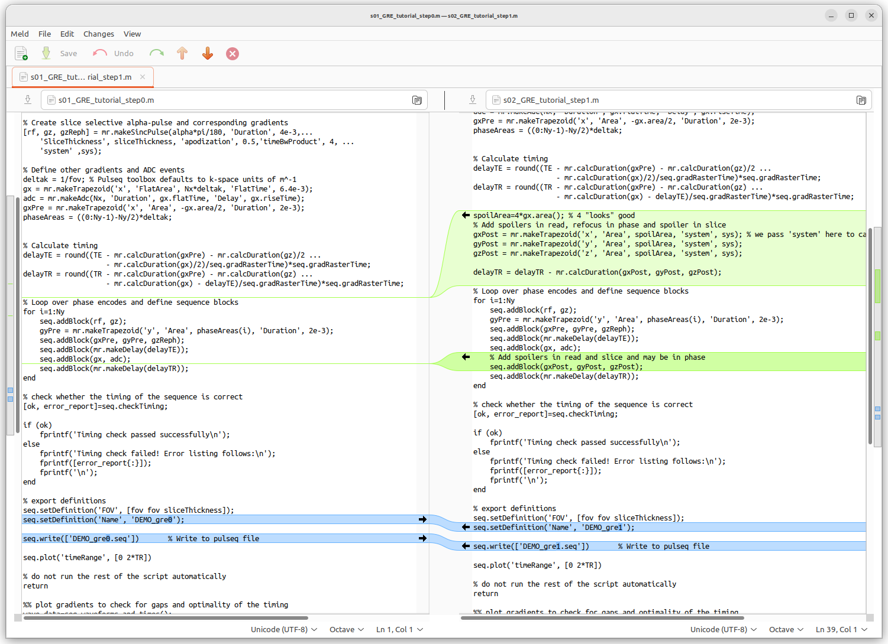

# Welcome to the Pulseq tutorials repository!

This is a collection of various Pulseq tutorials, which is supposed to grow in future. If you don't know where to start, read through  this document and study the [Pulseq Concepts](./doc/pulseq_Concepts_Nov2022.pdf) presentation. Thereafter work through the tutorials one-by-one. Please let us know if your favorite topic is missing or needs more attention, we will do our best to cover it in future.

## Foreword

The *Pulseq*[^1] software provides an open-source framework for the
development, analysis, display, and execution of magnetic resonance (MR)
sequences. To familiarise yourself with the Pulseq software, we
recommend starting your Pulseq journey with this *Pulseq Tutorial*. It
was initially developed for the Pulseq software demonstration and
hands-on session at the Italian Chapter of ISMRM 2022 in Pisa and a few
other live demos. This Tutorial contains example pulse sequences, raw MR
data in the Siemens TWIX format, and reconstruction scripts, ranging
from a free induction decay (FID) sequence to non-Cartesian radial and
spiral sequences, in the order of increasing complexity. This document
provides detailed instructions on how to work through the Tutorial.
After going through this guided tour, you will probably appreciate both
the simplicity and the power of Pulseq and be able to move on to
building your own sequences with Pulseq!

If you come across any problems, please contact our Pulseq
team: pulseq.mr-at-uniklinik-freiburg.de

## Naming convention of the tutorials in the collection
The tutorials are ordered by increasing complexity, so if unsure where to start, 01_... is a good option.

In more detail, the naming convention is

`LN_Topic`

where 

* **L** is a one-digit level going from 0 for *beginner* to 1 for *intermediate* to 2 *advanced*;
* **N** is a sequential single-digit number (this assumes we can only have up to 9 tutorials per complexity level);
* **Topic** is a free text briefly describing the scope of the tutorial.

For the absolute beginners [01_from_FID_to_PRESS](01_from_FID_to_PRESS) is a good start, which describes how to code sequences starting from a most basic FID pulse-acquire sequence moving on towards a reasonably optimised point-resolved spectroscopy (PRESS) sequence.

## Author and version

This tutorial was written by Qingping Chen (with some edits by Maxim Zaitsev)

*Division of Medical Physics, Department of Radiology,
University Medical Center Freiburg, Germany*

Initial revision created on June 21 2023

# Contents 

[**Foreword**](#foreword)

[**1. Prerequisites**](#1-prerequisites)

[1.1 MR Physics Background](#11-mr-physics-background)

[1.2 Programming Tool](#12-programming-tools)

[1.3 Pulseq Software](#13-pulseq-software)

[1.4 mapVBVD Software](#14-mapvbvd-software)

[1.5 Text Compare Tool](#15-text-compare-tool)

[**2. Introduction to Pulseq**](#2-introduction-to-pulseq)

[2.1 Matlab and Pulseq Sequence Files](#21-matlab-and-pulseq-sequence-files)

[2.2 Pulseq Interpreter](#22-pulseq-interpreter)

[2.3 Blocks and Events in Pulseq](#23-blocks-and-events-in-pulseq)

[**3. Tutorials Overview**](#3-tutorials-overview)

[From\_FID\_to\_PRESS](from_fid_to_press)

[Basic\_gradient\_echo](#basic_gradient_echo)

[From\_GRE\_to\_EPI](#from_gre_to_epi)

[Radial\_and\_nonCartesian](#radial_and_noncartesian)

# 1. Prerequisites

## 1.1 MR Physics Background

To be able to code MR sequences, knowledge in MR physics is required. We
recommend some useful books and websites listed below.

**Books:**

-   Brown et al., Magnetic Resonance Imaging: Physical Principles and
    Sequence Design, 2014.
    (<https://onlinelibrary.wiley.com/doi/book/10.1002/9781118633953>)

-   Nishimura, Principles of Magnetic Resonance Imaging, 2010.
    (<https://books.google.de/books/about/Principles_of_Magnetic_Resonance_Imaging.html?id=uz9BAQAAIAAJ&redir_esc=y>)

**Websites:**

-   Common questions and answers in MRI: <http://mriquestions.com/>.

-   MR Bloch Simulator:
    [www.drcmr.dk/BlochSimulator](http://www.drcmr.dk/BlochSimulator).

## 1.2 Programming Tools

-   Matlab software (https://mathworks.com/products/matlab.html) needs
    to be installed in your computer.

-   Basic familiarity with Matlab programming is required.

## 1.3 Pulseq Software

Please download the Pulseq software from
<https://github.com/pulseq/pulseq>. Install Pulseq software in Matlab by
adding its directory and subdirectories to Matlab's path.

## 1.4 mapVBVD Software

The mapVBVD software is required to read raw data in Siemens TWIX
format. The software can be downloaded from https://github.com/pehses/mapVBVD
and installed by adding its directory to Matlab's path.

## 1.5 Text Compare Tool

We recommend using a text comparison tool to compare the sequences
within the subsequent steps to visualise the changes that occur at each
step. *Meld* software can be used for text comparison and can be
downloaded from <https://meldmerge.org/>. By using Meld or other comparable
software packages, it is possible to very quickly make the relevant changes
easily visible, as in the example below.

# 2. Introduction to Pulseq

Pulseq is an open-source framework for the development, analysis,
display, and execution of MR sequences for imaging and spectroscopy.
Under this framework, one can directly program an MR sequence in Matlab
or Python and execute the Pulseq sequence file on real scanner hardware
through the corresponding Pulseq interpreter. A central contribution of
Pulseq is that it provides an open file format to compactly describe MR
pulse sequences suitable for execution on a real MR scanner. The
detailed *file specification* can be obtained from
<https://pulseq.github.io/specification.pdf>.

## 2.1 Matlab and Pulseq Sequence Files

For the generation of *Pulseq sequence files* that are readable by an MR
scanner, we run Matlab scripts (extension: **.m**), e.g. s01\_FID.m.
When a Matlab script runs successfully, a Pulseq sequence file is
created (extension: **.seq**), e.g. s01\_FID.seq. This file defines all
sequence timing and events, including RF, delays, trapezoid gradients,
arbitrary gradients, and ADC events. This forms a complete description
of the sequence and is ideal for rapid prototyping and executing
sequences programmed in alternative environments (e.g. JEMRIS). This
text file can be read by the Pulseq interpreter on the scanner and
stored as compressed sequence blocks in memory. Matlab and Python
toolboxes also provide functionality to read Pulseq .seq files.

## 2.2 Pulseq Interpreter

The Pulseq interpreter can be used to execute the Pulseq sequence file
(.seq file) generated by Matlab, PyPulseq or other tools on a particular
MR scanner. The interpreter for Siemens scanners can be obtained after
signing a Siemens C2P agreement (for more information, please send an
inquiry to pulseq.mr-at-uniklinik-freiburg.de). The source code contained
in the interpreter package can be compiled in the Siemen IDEA environment, and
then the .so and .dll files are produced. Copy both binary files to
the sequence folder on the MR scanner (folder defined by the
`%CustomerSeq%` variable, `C:\MedCom\MriCustomer\seq` for Numaris4
`C:\ProgramData\Siemens\Numaris\MriCustomer\CustomerSeq` for
NumarisX). These binary files of the Pulseq interpreter sequence are
universal and can be used for any .seq file, so they only need to be copied
to the scanner once.
The .seq file that you want to execute needs to be
placed in the subfolder `%CustomerSeq%\pulseq`. By default, the file
named `external.seq` is used. Important: for the default protocol
corresponding to the Pulseq interpreter sequence, a valid .seq file needs
to be placed in `%CustomerSeq%\pulseq` stored under the name
`external.seq`. To access the Pulseq interpreter sequence on the MR
scanner, you need to create the corresponding protocol and eventually
store it in your favourite examination folder. Navigate to Dot Cockpit->Program Editor->Browse->Default->Sequence Region->Customer sequences->Default. Now insert the Pulseq sequence into any protocol. Run this
protocol and it will automatically read the Pulseq file `external.seq`
in the folder `%CustomerSeq%\pulseq`. Refer to the Pulseq C2P documentation for
further details.

As for the Pulseq interpreter for GE scanners, Please go to <https://toppemri.github.io/> for more details.

## 2.3 Blocks and Events in Pulseq

Under the specification of the Pulseq file format, a sequence is
established based on at least one *block* (`id_block>0`). Each
entry in the block table declares a single block specified by a duration
(DUR) in the units of BlockDurationRaster and a list of six event IDs:

    <id_block> <dur> <rf_id> <gx_id> <gy_id> <gz_id> <adc_id> <ext_id>

The six events include an RF event (RF), three gradient events (GX, GY,
GZ), an ADC event (ADC), and an extension event (EXT). An event ID of 0
indicates no event.

The RF events are declared in a section with the `[RF]` keyword. Each
line in the section is specified by eight numbers:

    <rf_id> <amp> <mag_id> <phase_id> <time_id> <delay> <freq_offset> <phase_offset>

The GRADIENT events are declared in two sections. Arbitrary gradients
are located in the section marked with the `[GRADIENTS]` keyword. Each line in
the section is specified by five numbers:

    <grad_id> <amp> <shape_id> <time_id> <delay>

Trapezoidal gradients are located in the section labeled with the `[TRAP]`
keyword. Each line in this section is specified by six numbers:

    <grad_id> <amp> <rise> <flat> <fall> <delay>

As you may have noticed, arbitrary gradients and trapezoidal gradients 
share the same ID space - `grad_id` that uniquely identifies every gradient, 
with each ID only allowed to be present either in the `[GRADIENTS]` 
section or in the `[TRAP]` section.

The ADC section is declared with the `[ADC]` keyword. Each line in this
section is specified by six numbers:

    <adc_id> <num> <dwell> <delay> <freq_offset> <phase_offset>

The EXTENSION section is declared with the `[EXTENSIONS]` keyword. Each
line in the section is specified by four numbers:

    <ext_id> <type> <ref> <next>

Take one of the simplest MR experiments -- free induction decay (FID) as
an example. The FID sequence contains two blocks:

    [BLOCKS]
    1 62 1 0 0 0 0 0
    2 499947 0 0 0 0 1 0

The first block has a duration of 62 \* *BlockDurationRaster* us and contains
an RF event with an ID of 1. The block has no gradients or ADC events,
indicated by zero IDs and also no extension is specified. The RF event
is declared by a line:

    [RF]
    1 500 1 2 3 100 0 0

The RF event has a peak amplitude of 500 Hz and a delay of 100 us before
starting the RF pulse. The magnitude, phase, and time compressed shapes
are defined with the shape IDs of 1, 2, and 3, respectively. The RF
pulse has no frequency or phase offsets.

The second block has a duration of 499947 \* *BlockDurationRaster* us and
contains an ADC event with an ID of 1, declared by:

    [ADC]
    1 8192 31250 29730 0 0

The ADC event contains an ADC directive with 8192 samples, a dwell time of 31250
ns, and a delay of 29730 us between the start of the block and first
sample, and no frequency and phase offsets.

For more detailed specification of blocks and events, please refer to
the Pulseq specification documentation at
<https://pulseq.github.io/specification.pdf>.

# 3. Tutorials Overview

This section briefly introduces the tutorials one-by-one in a bit more detail.

## From\_FID\_to\_PRESS

This tutorial introduces a step-by-step design of a PRESS sequence
starting from a very basic FID sequence. See [01_from_FID_to_PRESS](./01_from_FID_to_PRESS).

## Basic\_gradient\_echo

This tutorial demonstrates how a very basic gradient-echo sequence (GRE) can be topped up with various degrees of sophistication to achieve a desired steady-state
magnetisation evolution with T1 contrast. See [02_basic_gradient_echo](./02_basic_gradient_echo).

## From\_GRE\_to\_EPI

This tutorial demonstrates a possible evolution of a gradient-echo sequence (GRE) to a multi-echo GRE, segmented GRE and finally to an echo-planar sequence (EPI). See [11_from_GRE_to_EPI](./11_from_GRE_to_EPI).

## Radial\_and\_nonCartesian

This tutorial presents two simple radial sequences that are derived from the corresponding Cartesian counterparts. Additionally, a fast radial GRE and a very basic 2D spiral are introduced. See [12_Radial_and_nonCartesian](./12_Radial_and_nonCartesian).

[^1]: Layton KJ, Kroboth S, Jia F, et al. Pulseq: A rapid and
    hardware-independent pulse sequence prototyping framework. *Magn
    Reson Med*. 2017;77(4):1544-1552. doi:10.1002/mrm.26235
